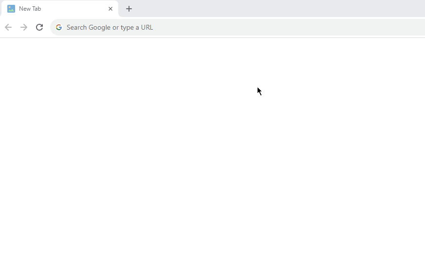

# Github Sorter

How many times have you endlessly scrolled through GitHub, opening lots of repos in lists like Awesome Lists to find the most starred repos? Don't do this anymore! GitHub Sorter sorts all GitHub repos in lists by stars, so you can quickly see which repos are the most popular.

## Install

1. Download the latest [github-sorter.zip](https://github.com/sir-kokabi/github-sorter/releases/latest)
2. Open the extension page in your browser by typing: `chrome://extensions/`
3. Enable developer mode by clicking the toggle switch in the top right corner of the page.
4. Drag and drop the downloaded `github-sorter.zip` onto the extension page.
5. Open [Github token page](https://github.com/settings/tokens) (Create a GitHub account if you don't have one). 
6. Click the `Generate new token` button, then click `Generate new token (classic)`
7. On the next page, enter the following information: 
    - Note: "Token"
    - Expiration: "no expirations"
    - Select scopes: "repo"
8. Click the `Generate token` button
6. Copy the generated token.
7. Click the Github Sorter extension icon in the toolbar and paste the token.
8. Now, when you visit any GitHub page that contains a list of repositories, all of the repositories will be sorted and show the number of stars.

