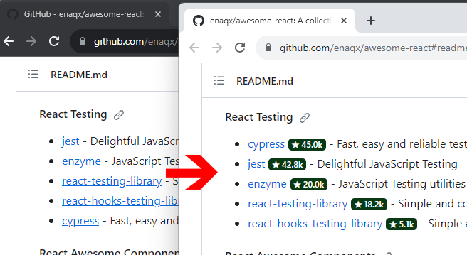

# Github Sorter

How many times have you opened countless new tabs to find top-starred projects on lists like Awesome Lists? Well, **[GitHub Sorter](https://github.com/sir-kokabi/github-sorter)** is here to make your life easier by sorting repos based on stars and displaying those shiny stars right beside each one. 😊🌟
.

## Install (Chrome, Edge, Opera, Brave, Vivaldi)

1. Download the latest [github-sorter.zip](https://github.com/sir-kokabi/github-sorter/releases/latest)
2. Open the extension page in your browser by typing: `chrome://extensions/`
3. Enable developer mode by clicking the toggle switch in the top right corner of the page.
4. Drag and drop the downloaded `github-sorter.zip` onto the extension page.
5. Open [Github token page](https://github.com/settings/tokens) (Create a GitHub account if you don't have one).
6. Click the `Generate new token` button, then click `Generate new token (classic)`
7. On the next page, enter the following information:
   - Note: `token` (or any preferred name)
   - Expiration: `no expirations`
   - Select scopes: `repo`
8. Click the `Generate token` button and then copy the generated token.
9. Click the Github Sorter extension icon in the toolbar and paste the token.
10. Now, when you visit any GitHub page that contains a list of repositories, all of the repositories will be sorted and show the number of stars.

**Download from stores (Firefox and opera):**

- Firefox: https://addons.mozilla.org/firefox/addon/github-sorter/
- Opera: https://addons.opera.com/extensions/details/github-sorter

## Support

Please star this repo, and better yet, donate if you find it useful.

- Bitcoin: **1LUbbaAGKFkaSXgDhD4AAc8i2kipW6Qh2R**
- Ethereum: **0xaEC3571C6207B05A41Ab35b40a4B6DF04A072450**
- [پرداخت از داخل ایران](https://zarinp.al/kokabi)
